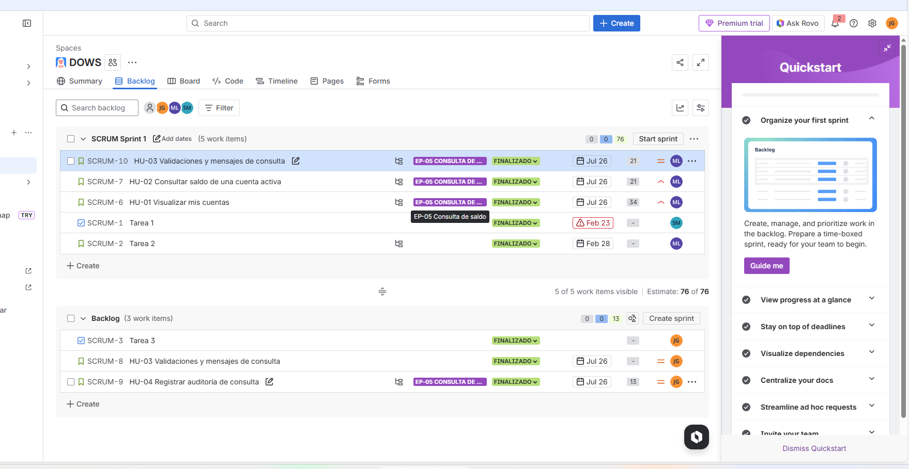

        # 📄 Planeación del Sistema en Jira

## Desglose de trabajo: Épicas, Historias de Usuario y Tareas

La implementación de los requerimientos identificados de Bankify se desglosa de la siguiente manera:

### 1. Épica:

### 2. Historias de usuario:

--- 

---

---

--- 

### 3. Tareas:

--- 

---

---

---

### 4. Cronograma:

### 5. Backlog:   !
**Justificación de la planeación:**
Se priorizaron HU-01 y HU-02 porque habilitan el flujo base de consulta. HU-03 se incluyó para manejar validaciones y mensajes, reduciendo errores y retrabajo. Las tareas adicionales se asignaron según capacidad del equipo y para asegurar responsabilidad clara por cada ítem.| TR-11                                                                                                                                 |
